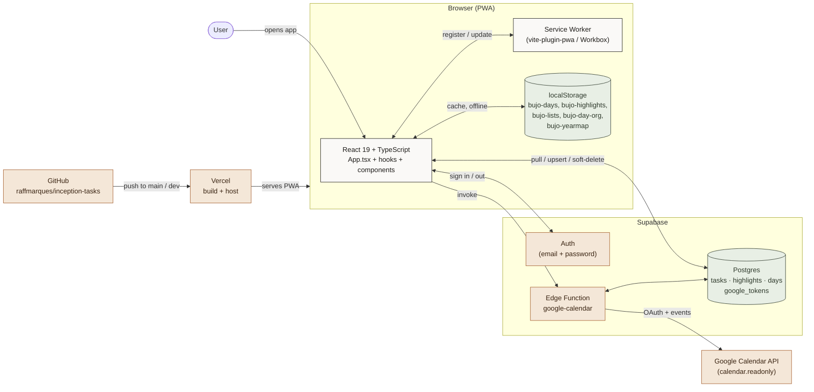
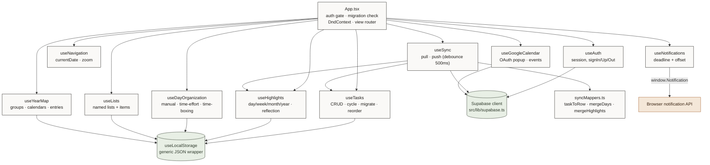
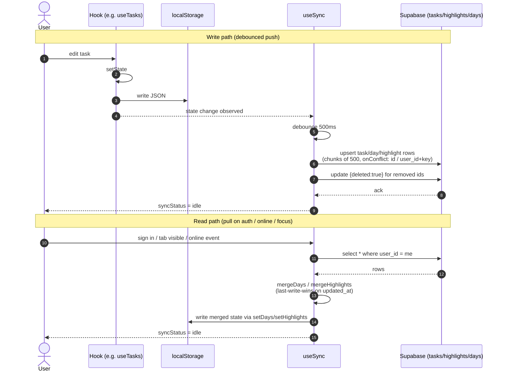
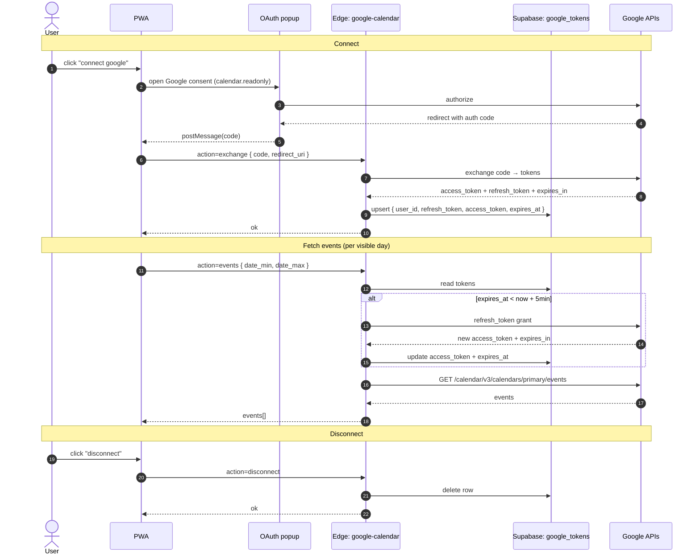

# Architecture

Visual reference for how **bujo** is wired together: the runtime, the hooks, the storage layers, and the external services. All diagrams use [Mermaid](https://mermaid.js.org/) and render natively on GitHub.

> Companion doc: [`user-flow.md`](./user-flow.md) — how a user moves through the app.

---

## 1. System context

What runs where, and how the pieces talk to each other.

The PWA is **offline-first**: all writes hit `localStorage` immediately and React re-renders from there. Supabase is a sync target, not the source of truth at runtime — if `VITE_SUPABASE_URL` is unset the app runs as a pure local app with no login. Google Calendar is reached only through the `google-calendar` Edge Function so client-side code never holds OAuth secrets.

---

## 2. Frontend hook graph

`App.tsx` is the wiring harness. Each domain lives in its own custom hook, and most state ultimately lands in `localStorage` via `useLocalStorage`.

Two things to notice. First, `useSync` is the only module that holds references to *both* the local domain hooks and the Supabase client — every other hook is unaware that Supabase exists. Second, `useNavigation` is pure UI state (no persistence): refreshing the page returns you to today.

---

## 3. Data sync sequence (localStorage ↔ Supabase)

How a single edit propagates from the UI to the cloud, and how a remote change comes back.

Pushes are batched and deletes are *soft* — rows get `deleted: true` rather than being removed, so a future client that comes online late can still detect the deletion. The 500ms debounce coalesces rapid edits (typing, dragging) into a single round-trip.

---

## 4. Google Calendar OAuth + events

The browser never sees Google's client secret. The `google-calendar` Edge Function brokers the OAuth exchange and refresh, and stores tokens in the `google_tokens` table.

The 5-minute buffer on `expires_at` avoids the race where a token is accepted by us but expires mid-request at Google. The same Edge Function handles all three actions so the client only ever calls one endpoint.

---

## File index

| Concern | File |
|---|---|
| App composition, auth gate, migration check | `src/App.tsx` |
| Sync loop (pull / push / debounce / reconnect) | `src/hooks/useSync.ts` |
| Row mappers + merge functions | `src/utils/syncMappers.ts` |
| Supabase client | `src/lib/supabase.ts` |
| Google Calendar hook | `src/hooks/useGoogleCalendar.ts` |
| Google Calendar Edge Function | `supabase/functions/google-calendar/index.ts` |
| DB schema migrations | `supabase/migrations/*.sql` |
| PWA + build config | `vite.config.ts` |
| Type definitions | `src/types/index.ts` |
