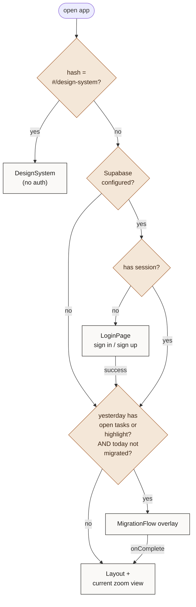
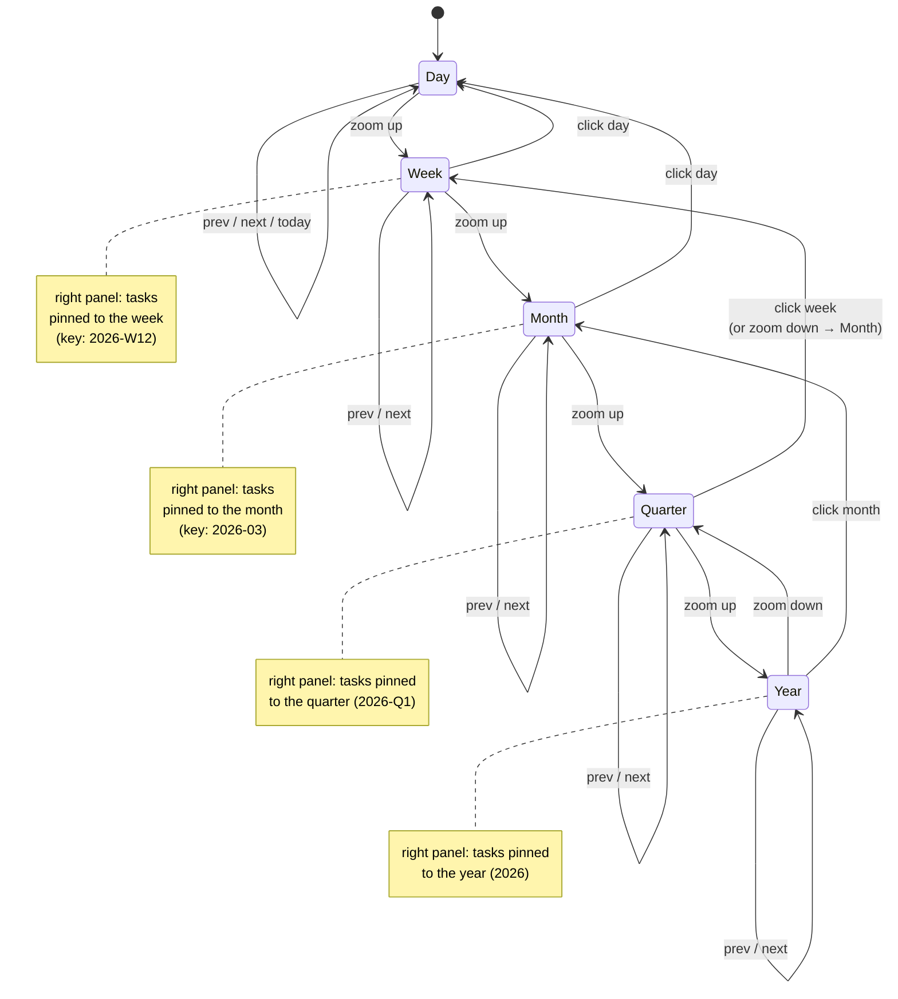
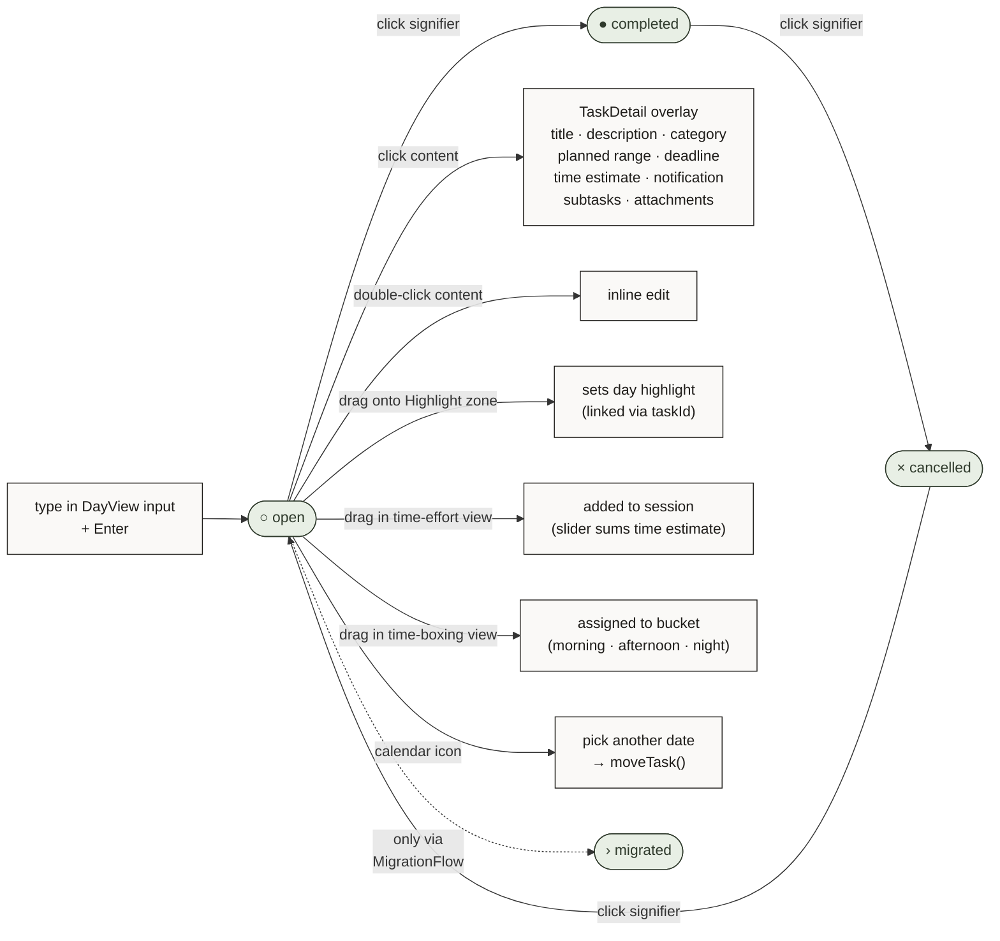
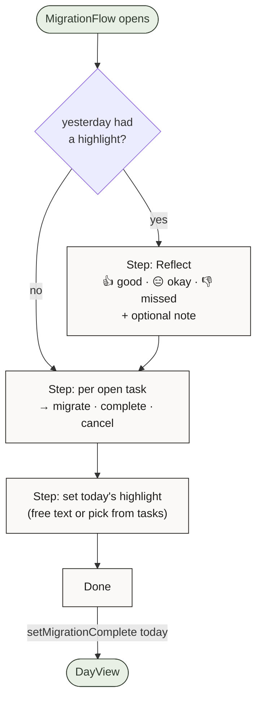
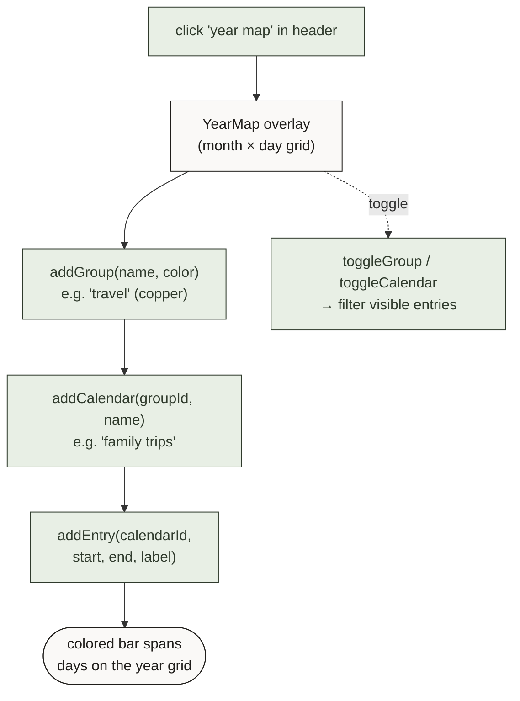
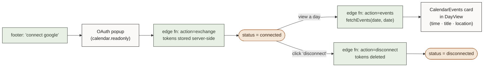
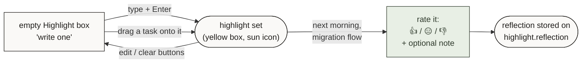

# User Flow

How a real user moves through **bujo** — entry, daily ritual, navigation, and the side surfaces (lists, year map, calendar). All diagrams are [Mermaid](https://mermaid.js.org/) and render natively on GitHub.

> Companion doc: [`architecture.md`](./architecture.md) — what the app is made of.

---

## 1. App entry

What happens between opening the app and seeing the day.

The app degrades cleanly: with Supabase unconfigured there is no login, and without yesterday's leftovers there is no migration prompt. The migration check looks at `getDay(today).migrationComplete` plus `getOpenTasksForDate(yesterday)` and `getHighlight('day', yesterday)` — see `src/App.tsx:160-172`.

---

## 2. Zoom navigation

The single navigational primitive in the app: zoom in and out across time.

Period-pinned tasks live in the same `days[]` map as daily tasks, just keyed by `2026-W12`, `2026-03`, `2026-Q1`, `2026` instead of `YYYY-MM-DD`. That's why the same `addTask` / `cycleTaskStatus` work at every zoom level.

---

## 3. Daily task lifecycle

Everything you can do to a single task on a single day.

The signifier click cycles through only `open → completed → cancelled → open` (`useTasks.ts:66`). `migrated` and `scheduled` are explicit transitions — `migrated` is set during the migration flow when a task moves to a new day, and `scheduled` is set when a task is given a future planned date.

---

## 4. Migration flow

The morning ritual. Triggered automatically by the entry decision in §1.

Picking *migrate* on a task sets its status to `migrated` on yesterday and re-creates it as `open` on today, preserving the original creation date — that's how `migrateTask(yesterdayKey, taskId, todayKey)` is wired in `App.tsx:218`.

---

## 5. Lists side flow

Reference lists you can drag into a day to turn them into tasks.

```mermaid
flowchart LR
    open["click 'lists' in header"] --> panel["ListsPanel slides in"]
    panel --> add["type list name + Enter<br/>→ addList"]
    add --> items["type item content + Enter<br/>→ addItem"]
    items --> drag["grab item ⠿<br/>drag over a day"]
    drag --> drop["drop on DayDropZone"]
    drop --> created["addTask(date, item.content)<br/>removeItem(listId, itemId)"]
    created --> task(["task appears in DayView,<br/>item is gone from list"])

    classDef screen fill:#faf9f7,stroke:#1f1d1a,color:#1f1d1a
    classDef action fill:#e8efe5,stroke:#2f3a2c,color:#2f3a2c
    class panel,task screen
    class open,add,items,drag,drop,created action
```

The drop is detected by id prefix `day-drop-${date}` in the outer `DndContext` (`App.tsx:117-121`). The inner sortable context for tasks within a day uses a separate `DndContext` so reordering and list-drops don't collide.

---

## 6. Year Map side flow

A year-at-a-glance overlay for vacations, sprints, anything spanning multiple days.

Year Map data is local-only (key `bujo-yearmap`) — it is *not* synced to Supabase today. The 10-color palette and group/calendar/entry hierarchy is enforced by `useYearMap`.

---

## 7. Google Calendar (read-only)

Optional integration. Events appear inline in the DayView; the app never writes back to Google.

Auto-fetch only fires when `currentZoom === 'day'` and `gcal.status === 'connected'` (`App.tsx:131-135`), so other zoom levels don't burn quota. The technical sequence (token refresh, edge function actions) is in [`architecture.md` §4](./architecture.md#4-google-calendar-oauth--events).

---

## 8. Highlight & reflection

The thing that makes this a *highlight* journal rather than a plain todo list.

Highlights exist independently at every zoom level (day / week / month / year), keyed `${level}-${date}`. Only the day-level highlight participates in the next-day reflection prompt.

---

## Component index

| Surface | Components |
|---|---|
| Entry / auth | `src/App.tsx`, `src/components/Auth/LoginPage.tsx` |
| Migration | `src/components/MigrationFlow/*` |
| Day view | `src/components/DayView/*`, `src/components/Highlight/*`, `src/components/TaskItem/*` |
| Day organization modes | `src/components/DayView/{ModeSelector,TimeEffortView,TimeBoxingView}.tsx` |
| Other zoom levels | `src/components/{Week,Month,Quarter,Year}View/*` |
| Task detail overlay | `src/components/TaskDetail/*` |
| Lists | `src/components/Lists/{ListsPanel,DayDropZone}.tsx` |
| Year Map | `src/components/YearMap/*` |
| Google Calendar | `src/components/CalendarEvents/*` |
| Layout shell (header / footer) | `src/components/Layout/Layout.tsx` |
| Zoom navigation | `src/components/ZoomNav/*` |
